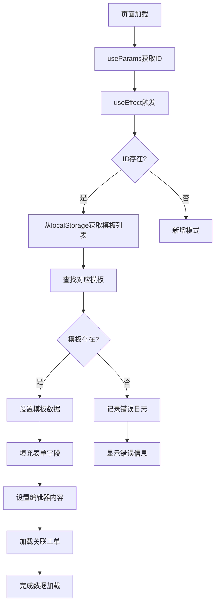
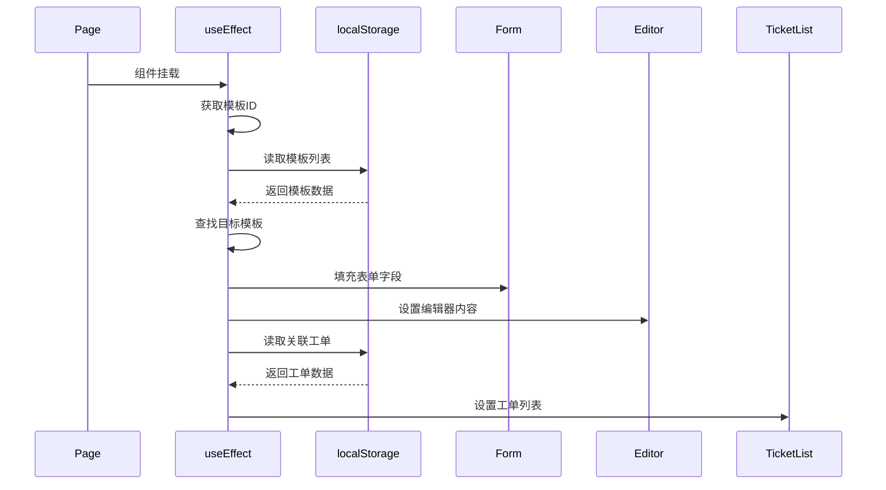

# 模板数据加载问题修复 - 架构设计

## 整体架构图



## 核心组件设计

### 1. 数据加载模块

#### 职责
- 从localStorage获取模板数据
- 验证数据完整性
- 处理数据加载错误

#### 接口定义
```typescript
interface TemplateLoader {
  loadTemplate(id: string): ReportTemplate | null;
  validateTemplateData(template: any): boolean;
  logLoadingProcess(step: string, data: any): void;
}
```

### 2. 调试日志系统

#### 职责
- 记录数据加载过程
- 输出关键变量状态
- 帮助问题诊断

#### 日志级别
- INFO: 正常流程信息
- WARN: 警告信息
- ERROR: 错误信息
- DEBUG: 调试详细信息

### 3. 数据验证模块

#### 职责
- 验证模板ID格式
- 验证localStorage数据结构
- 验证模板数据完整性

## 数据流向图



## 异常处理策略

### 1. 数据不存在处理
```typescript
if (!currentTemplate) {
  console.warn(`模板不存在: ${id}`);
  message.warning('模板数据不存在，请检查模板ID');
  return;
}
```

### 2. JSON解析错误处理
```typescript
try {
  const existingTemplates = JSON.parse(localStorage.getItem('reportTemplates') || '[]');
} catch (error) {
  console.error('解析模板数据失败:', error);
  message.error('模板数据格式错误');
  return;
}
```

### 3. 数据格式验证
```typescript
const validateTemplate = (template: any): boolean => {
  return template && 
         typeof template.id === 'string' &&
         typeof template.name === 'string' &&
         template.content_structure;
};
```

## 调试日志设计

### 日志输出格式
```typescript
const logTemplate = (step: string, data: any) => {
  console.group(`🔍 [模板加载] ${step}`);
  console.log('时间:', new Date().toISOString());
  console.log('数据:', data);
  console.groupEnd();
};
```

### 关键日志点
1. useEffect开始执行
2. 模板ID获取
3. localStorage数据读取
4. 模板查找结果
5. 表单数据设置
6. 编辑器内容设置
7. 关联工单加载
8. 数据加载完成

## 性能考虑

### 1. 避免重复加载
- 使用useEffect依赖数组
- 缓存已加载的数据

### 2. 调试日志优化
- 生产环境可关闭详细日志
- 使用条件编译控制日志输出

### 3. 错误边界
- 添加错误边界组件
- 防止单个错误影响整个页面

## 集成方案

### 与现有系统集成
1. 保持现有的localStorage数据结构
2. 复用现有的表单和编辑器组件
3. 保持现有的路由和导航逻辑

### 向后兼容性
1. 新增的调试代码不影响现有功能
2. 数据验证失败时降级到原有逻辑
3. 保持现有的API接口不变