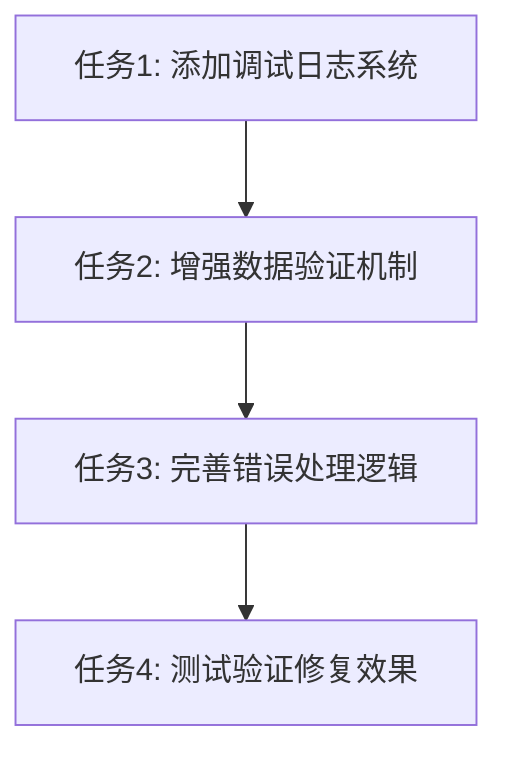

# 模板数据加载问题修复 - 任务拆分

## 任务依赖图

## 原子任务列表

### 任务1: 添加调试日志系统

#### 输入契约
- **前置依赖**: 无
- **输入数据**: ReportTemplateEdit.tsx文件
- **环境依赖**: React开发环境

#### 输出契约
- **输出数据**: 包含详细调试日志的useEffect代码
- **交付物**: 修改后的ReportTemplateEdit.tsx文件
- **验收标准**: 
  - 控制台显示模板ID获取过程
  - 显示localStorage数据读取结果
  - 显示模板查找和数据设置过程
  - 显示关联工单加载过程

#### 实现约束
- 使用console.group和console.log进行结构化日志输出
- 日志信息要包含时间戳和详细数据
- 不影响现有功能逻辑
- 保持代码可读性

#### 依赖关系
- **后置任务**: 任务2
- **并行任务**: 无

---

### 任务2: 增强数据验证机制

#### 输入契约
- **前置依赖**: 任务1完成
- **输入数据**: 包含调试日志的useEffect代码
- **环境依赖**: React开发环境

#### 输出契约
- **输出数据**: 包含数据验证的useEffect代码
- **交付物**: 增强验证机制的ReportTemplateEdit.tsx文件
- **验收标准**:
  - 验证模板ID的有效性
  - 验证localStorage数据的存在性
  - 验证模板数据结构的完整性
  - 验证关联工单数据的格式

#### 实现约束
- 添加数据类型检查
- 添加数据存在性验证
- 使用TypeScript类型安全
- 保持性能优化

#### 依赖关系
- **前置任务**: 任务1
- **后置任务**: 任务3
- **并行任务**: 无

---

### 任务3: 完善错误处理逻辑

#### 输入契约
- **前置依赖**: 任务2完成
- **输入数据**: 包含数据验证的useEffect代码
- **环境依赖**: React开发环境，Ant Design组件库

#### 输出契约
- **输出数据**: 包含完整错误处理的useEffect代码
- **交付物**: 最终版本的ReportTemplateEdit.tsx文件
- **验收标准**:
  - 添加try-catch错误捕获
  - 处理JSON解析异常
  - 处理数据不存在的情况
  - 显示用户友好的错误提示

#### 实现约束
- 使用Ant Design的message组件显示错误
- 错误处理不能中断正常流程
- 提供降级处理方案
- 记录详细的错误日志

#### 依赖关系
- **前置任务**: 任务2
- **后置任务**: 任务4
- **并行任务**: 无

---

### 任务4: 测试验证修复效果

#### 输入契约
- **前置依赖**: 任务3完成
- **输入数据**: 完整修复的ReportTemplateEdit.tsx文件
- **环境依赖**: 开发服务器运行环境

#### 输出契约
- **输出数据**: 测试结果报告
- **交付物**: 验证文档和问题修复确认
- **验收标准**:
  - 编辑不同模板显示不同内容
  - 控制台显示完整的调试信息
  - 错误情况得到正确处理
  - 用户体验无明显影响

#### 实现约束
- 测试多个不同的模板ID
- 验证localStorage数据的正确性
- 检查控制台日志的完整性
- 确认错误处理的有效性

#### 依赖关系
- **前置任务**: 任务3
- **后置任务**: 无
- **并行任务**: 无

## 复杂度评估

### 任务1: 低复杂度
- 主要是添加日志输出代码
- 不涉及逻辑变更
- 风险较低

### 任务2: 中等复杂度
- 需要理解数据结构
- 添加验证逻辑
- 需要考虑性能影响

### 任务3: 中等复杂度
- 需要处理多种异常情况
- 要保证用户体验
- 需要测试错误场景

### 任务4: 低复杂度
- 主要是功能验证
- 不涉及代码修改
- 风险最低

## 总体时间估算
- 任务1: 15分钟
- 任务2: 20分钟
- 任务3: 25分钟
- 任务4: 10分钟
- **总计**: 约70分钟

## 风险评估
- **技术风险**: 低 - 主要是增强现有功能
- **业务风险**: 低 - 不改变核心业务逻辑
- **用户体验风险**: 低 - 主要是问题修复
- **性能风险**: 低 - 调试代码对性能影响微小